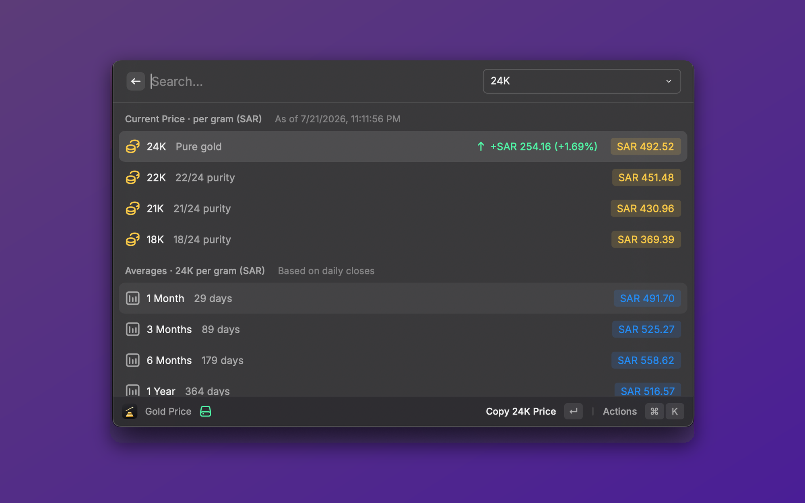

# Gold Price

See the daily gold price **per gram** for the karats commonly quoted in Gulf gold markets — **24K, 22K, 21K, 18K** — along with **1-month, 3-month, 6-month, and 1-year averages**.

> Prices are shown in **Saudi Riyal (SAR)** by default. Pick a different **Display Currency** in the extension preferences (SAR, AED, KWD, QAR, BHD, OMR, USD, EUR, GBP).

## Screenshots

## Features

- **Live spot price** per gram for 24K / 22K / 21K / 18K.
- **Daily change** vs. the previous close (on the 24K row).
- **Period averages** (1M / 3M / 6M / 1Y) computed from real daily closes.
- **Karat selector** — switch which karat the averages are shown for.
- **Selectable display currency** — SAR, AED, KWD, QAR, BHD, OMR, USD, EUR, or GBP.
- **Quota-friendly caching** so it stays comfortably inside the free API tier.

## Setup

This extension uses the [metals.dev](https://metals.dev) API.

1. Create a free account at **https://metals.dev/pricing** and copy your API key (the free tier allows 100 requests/month — plenty, thanks to caching).
2. Open the command in Raycast; when prompted, paste your key into **metals.dev API Key** in the extension preferences.

## How the data works

- **Current price** comes from the metals.dev `latest` endpoint, returned directly in the display currency per troy ounce, then converted to per-gram per karat.
- **Averages** are computed from a rolling ~1-year daily history (the metals.dev `timeseries` endpoint), stored locally. Completed months are immutable and cached permanently; only recent days are refetched, so day-to-day usage costs ~1–2 requests.
- Prices are indicative spot values and may differ from local retail prices, which include making charges and dealer margins.

## Karat conversion

Per-gram prices are derived from the 24K spot price:

- 1 troy ounce = 31.1034768 grams
- `price_per_gram_24k = spot_per_troy_ounce / 31.1034768`
- `price_per_gram_Nk  = price_per_gram_24k × (N / 24)`
